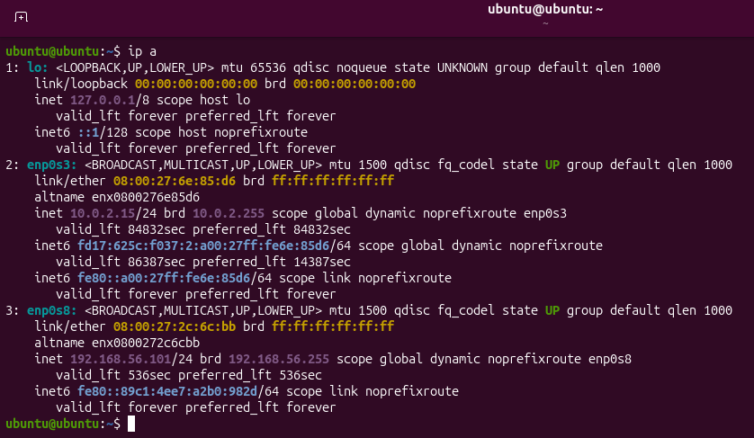
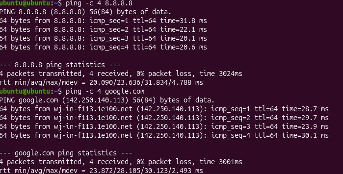
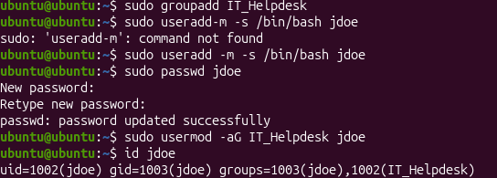
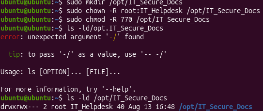
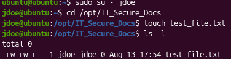
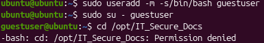

# IT-Support-Lab-Portfolio
Hands-on IT Support, Systems Administration, and Networking Lab Projects
---
## Phase 1: Network Diagnostics & Connectivity

In this phase, I diagnosed local network adapter settings, tested external IP reachability via ICMP, and verified DNS name resolution.

* **Checked Local IP & Adapter State:** `ip a` — Displays network interfaces, status, and assigned local IPv4/IPv6 addresses.
* **Tested Internet Reachability:** `ping -c 4 8.8.8.8` — Sends ICMP Echo Requests to Google's public DNS server to confirm outbound internet connectivity (bypassing DNS).
* **Tested DNS Resolution:** `ping -c 4 google.com` — Verifies that the system can translate human-readable domain names into machine-readable IP addresses.

## Phase 2: Role-Based Access Control & User Provisioning

### 1. Security Group & User Creation
Created an IT security group and added a new user account to give them the right permissions.

* **Commands Executed:**
  * `sudo groupadd IT_Helpdesk` — Creates the secondary security group for IT personnel.
  * `sudo useradd -m -s /bin/bash jdoe` — Creates user account `jdoe`, generates a `/home` directory (`-m`), and sets the default shell to Bash (`-s /bin/bash`).
  * `sudo passwd jdoe` — Sets an initial password for authentication.
  * `sudo usermod -aG IT_Helpdesk jdoe` — Appends user `jdoe` to the `IT_Helpdesk` secondary group without overwriting existing memberships.
  * `id jdoe` — Validates user UID, default GID, and assigned group memberships.

### 2. Shared Directory & Permission Handling

Created a departmental directory and applied strict permissions so only authorized team members can access it.

Commands Executed:
* `sudo mkdir /opt/IT_Secure_Docs` — Creates the shared directory under /opt for departmental files.
* `sudo chown -R root:IT_Helpdesk /opt/IT_Secure_Docs` — Sets user ownership to root and group ownership to IT_Helpdesk recursively (-R).
* `sudo chmod -R 770 /opt/IT_Secure_Docs` — Applies "770" permissions (rwxrwx---), granting full access to root and IT_Helpdesk members while completely blocking all other system users.
* `ls -ld /opt/IT_Secure_Docs` — Displays long-format directory metadata to verify ownership, group assignment, and permissions.

### Phase 3: Access Control Verification

#### Authorized Access Test
Switched to user `jdoe` (member of `IT_Helpdesk`) and verified full read/write capabilities inside `/opt/IT_Secure_Docs`.

#### Unauthorized Access Blocked Test (User: `guestuser`)
Created a standard user account (`guestuser`) without adding them to `IT_Helpdesk` to test if unauthorized users are properly locked out.

Commands Executed:
* `sudo useradd -m -s /bin/bash guestuser` — Creates a home directory for the new user account named 'guestuser'
* `sudo su - guestuser` — Switches to the guestuser account
* `cd /opt/IT_Secure_Docs` — Attempted to access the IT department files, but guestuser was denied access because it is in the 'Other' group with 0 rwx permissions.

